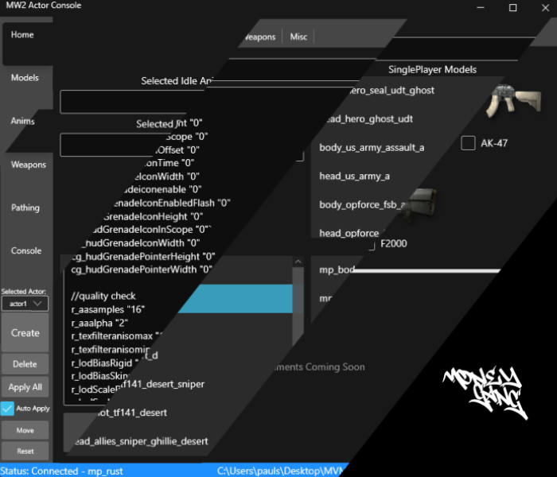

<h1 align="center">
   
  Actor Console
   
</h1>

  
  
  

<h4 align="center">Managing IW4 Actors Made Easy!</h4>
<h4 align="center">This is a beta release</h4>

  

## What Is Actor Console?

Actor Console for IW4 clients is an external GUI application for interacting with the [IW4 Cinematic Mod By Sass](https://github.com/sortileges/iw4cine). It enables you to manage your actors more efficiently and provide an easy GUI based way to do so.

## Installation

1. Download latest version from releases.
2. Start ActorConsole.exe
3. Select your precache
4. Done!
                                       

## FAQ

* How do I change my selected precache directory?
    * Right click on the directory in the bottom right status bar to reset.

* What clients does it support? Iw4x, Iw4m, Steam?
    * It officially supports Iw4m and Iw4x! 

For more information, visit the [wiki](https://github.com/kruumy/Actor-Console-iw4/wiki)

## Credit
* Wip
